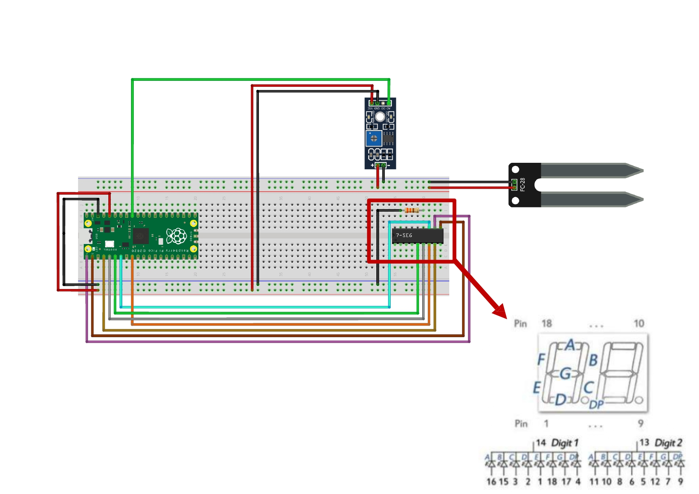
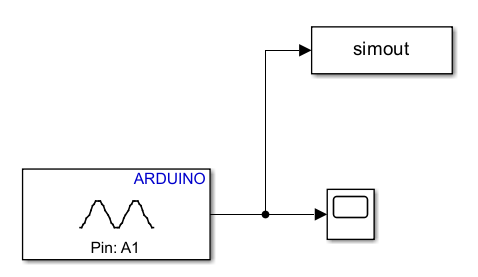
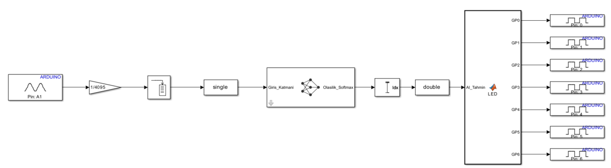
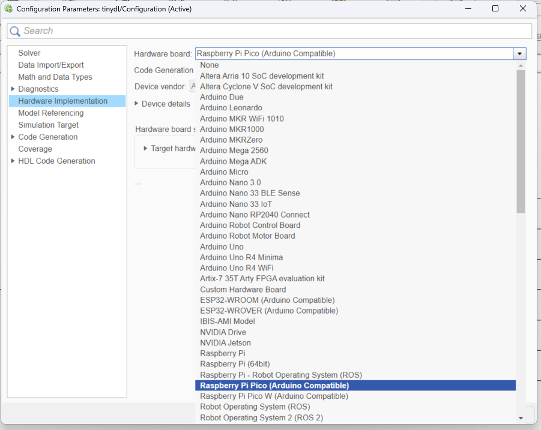
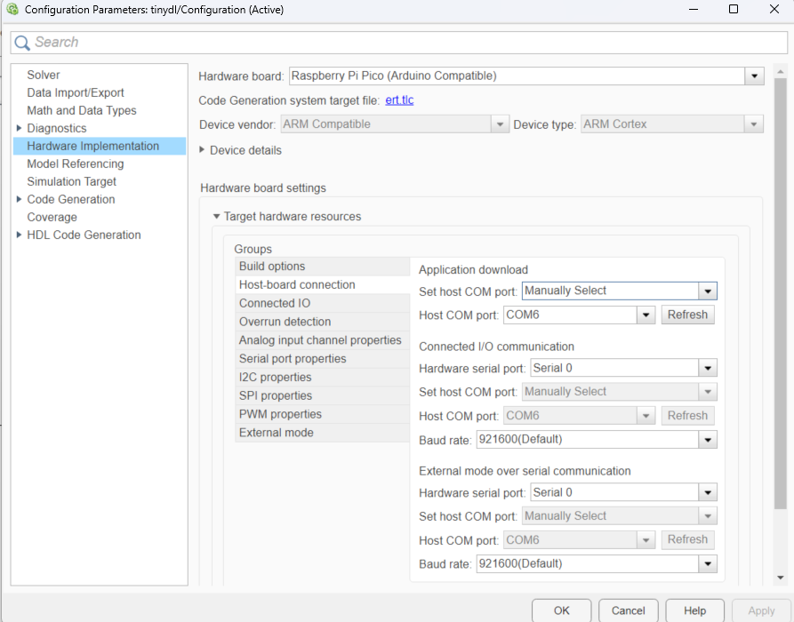

# TinyDL Moisture Detection on Raspberry Pi Pico

An end-to-end embedded machine learning project that classifies surface moisture conditions (**Dry** or **Wet**) in real time using a 1D Convolutional Neural Network deployed on a Raspberry Pi Pico. The inference result is displayed on a 7-segment display.

## Overview

This project demonstrates a complete TinyDL pipeline — from raw sensor data collection to on-device inference — built entirely within the MATLAB & Simulink ecosystem. A capacitive moisture sensor feeds analog readings into a trained 1D CNN running on the RP2040 microcontroller, and the prediction is shown on a 7-segment LED display that counts from 0 to 9 on startup before switching to live classification output.

## Hardware

| Component | Description |
|-----------|-------------|
| Raspberry Pi Pico (RP2040) | Target microcontroller |
| FC-28 Capacitive Moisture Sensor | Analog moisture sensing module |
| SH5261AS 7-Segment Display | Dual-digit common cathode LED display |
| Resistors | 330 Ω current limiting resistor (Orange-Orange-Brown) for 7-segment display |
| Breadboard & Jumper Wires | Prototyping |

### Pin Mapping

| Pico Pin | Connection |
|----------|------------|
| GP27 (A1) | Moisture sensor analog output |
| GP0 | 7-Segment — Segment A |
| GP1 | 7-Segment — Segment B |
| GP2 | 7-Segment — Segment C |
| GP3 | 7-Segment — Segment D |
| GP4 | 7-Segment — Segment E |
| GP5 | 7-Segment — Segment F |
| GP6 | 7-Segment — Segment G |
| 3V3 / GND | Sensor and display power |

### Circuit Diagram



## Software Requirements

- MATLAB 
- Simulink
- Deep Learning Toolbox
- Simulink Support Package for Arduino Hardware
- Embedded Coder

## Project Pipeline

### 1. Data Collection

Sensor data was collected using Simulink in **Monitor & Tune** mode. The analog input from the moisture sensor (Pin A1) was routed to a `To Workspace` block to capture time-series data for both dry and wet surface conditions.



### 2. Data Preprocessing

Raw sensor readings were segmented into fixed-length windows of 50 samples and reshaped into the format expected by a 1D CNN (`[1 × 50 × N]`). Labels were assigned as `0` (Dry) and `1` (Wet).

```matlab
pencere_boyutu = 50;
X_kuru = reshape(kuru_kesilmis, [1, pencere_boyutu, kuru_uzunluk/pencere_boyutu]);
X_islak = reshape(islak_kesilmis, [1, pencere_boyutu, islak_uzunluk/pencere_boyutu]);
X_Train = cat(3, X_kuru, X_islak);
Y_Train = categorical([zeros(size(X_kuru,3),1); ones(size(X_islak,3),1)]);
```

See [`data_import.m`](data_import.m) for the full preprocessing script.

### 3. Model Architecture

A lightweight 1D CNN designed for microcontroller deployment:

| # | Layer | Description |
|---|-------|-------------|
| 1 | Sequence Input | 1-D input (window of 50 samples) |
| 2 | 1-D Convolution | 16 filters, kernel size 5, stride 1, padding 'same' |
| 3 | Batch Normalization | Normalizes activations across 16 channels |
| 4 | ReLU | Activation function |
| 5 | 1-D Global Average Pooling | Reduces spatial dimensions |
| 6 | Fully Connected | 2 output neurons (Dry / Wet) |
| 7 | Softmax | Class probability output |

### 4. Training

The dataset was split 80/20 for training and validation. The model was trained using the Adam optimizer for 30 epochs with a learning rate of 0.001.

```matlab
options = trainingOptions('adam', ...
    'MaxEpochs', 30, ...
    'MiniBatchSize', 16, ...
    'InitialLearnRate', 0.001, ...
    'ValidationData', {X_Validation, Y_Validation}, ...
    'ValidationFrequency', 5, ...
    'Plots', 'training-progress');

trainedNetwork_1 = trainNetwork(X_Train_Final, Y_Train_Final, layers, options);
```

See [`train_script.m`](train_script.m) for the full training script.

### 5. Deployment

The trained network was integrated into a Simulink model and deployed to the Raspberry Pi Pico using the **Simulink Support Package for Arduino Hardware**. Code generation was handled by Embedded Coder with the `ert.tlc` system target file.



**Simulink Signal Flow:**

```
Analog Input (A1) → 1/4095 (Normalize) → Buffer (50 samples)
    → single → [1D CNN Inference] → Idx → double
    → MATLAB Function (LED) → Digital Write (GP0–GP6) → 7-Segment Display
```

### 6. Display Logic

A MATLAB Function block maps the CNN prediction to 7-segment display outputs. On startup, the display counts from 0 to 9 as a self-test, then switches to live inference mode showing `1` (Dry) or `2` (Wet).

```matlab
function [GP0, GP1, GP2, GP3, GP4, GP5, GP6] = LED(AI_Tahmin)
    persistent sayac baslangic_bitti
    if isempty(sayac)
        sayac = 0;
        baslangic_bitti = false;
    end

    if ~baslangic_bitti
        gosterilecek_deger = sayac;
        sayac = sayac + 1;
        if sayac > 9, baslangic_bitti = true; end
    else
        gosterilecek_deger = AI_Tahmin;
    end

    switch gosterilecek_deger
        case 1, GP0=0; GP1=1; GP2=1; GP3=0; GP4=0; GP5=0; GP6=0;
        case 2, GP0=1; GP1=1; GP2=0; GP3=1; GP4=1; GP5=0; GP6=1;
        % ... (full mapping for digits 0–9)
    end
end
```

### Configuration

**Hardware Implementation Settings:**




- **Hardware board:** Raspberry Pi Pico (Arduino Compatible)
- **Device vendor:** ARM Compatible — ARM Cortex
- **System target file:** `ert.tlc`
- **COM port:** Manually selected (COM6)
- **Baud rate:** 921600

## Repository Structure

```
├── tinydl.slx                  # Main Simulink model
├── data_import.m               # Data preprocessing script
├── train_script.m              # Model training script
├── tiny_beyin.mat              # Trained network weights
├── data.mat                    # Collected sensor data
├── WS.mat                      # Workspace variables
├── docs/                       # Documentation images
│   ├── circuit_diagram.jpg
│   ├── data_export.png
│   ├── simulink_model.png
│   ├── hw_settings.png
│   └── host_settings.png
└── README.md
```

## How to Use

1. **Clone** this repository.
2. Open `tinydl.slx` in Simulink (R2025b or later).
3. Connect the Raspberry Pi Pico via USB.
4. Set the correct COM port under **Hardware Implementation > Target Hardware Resources > Host-board connection**.
5. Click **Hardware > Build, Deploy & Start**.
6. The 7-segment display will count 0–9, then begin showing live predictions.

## Demo

> *Demo video/photo link will be added here.*

## License

This project is released under the [MIT License](LICENSE).
